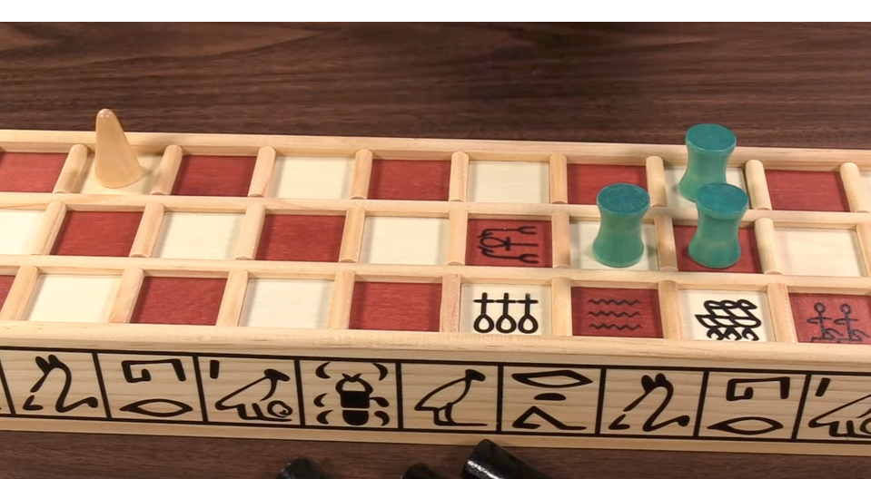
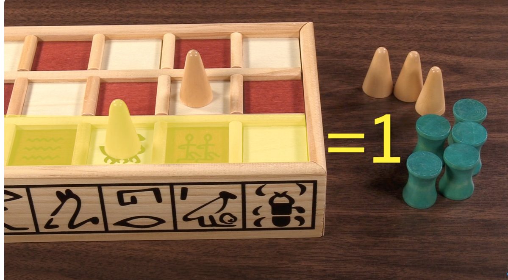

# How to Play

## How dice works

## Winner gets to choose dark pieces

## Roll again if you roll these:
### 1,4,6

## Make your move and end your turn if you roll these:
### 2,3
## If someone comes at you, you replace places:

## You cannot land on top of your stone:

## Two consequent pieces makes a party, you can't attack them:

## Three consequent pieces make a block, you can't pass them:

## If there is no possible move forwards, you should move backwards:

## and swap places if required:

## Water is trap:

## You go back to middle if you land on water:

## There are 3 safe places on the board:

## You can not attack a safe place:

## you need to get out all of your stones:

## you cannot go out if you still have stone in first grid:

## when you take all of your stones, you earn one point for each stone at 3rd gridline:

## and 3 points for each stone at 1st and 2nd gridline:

